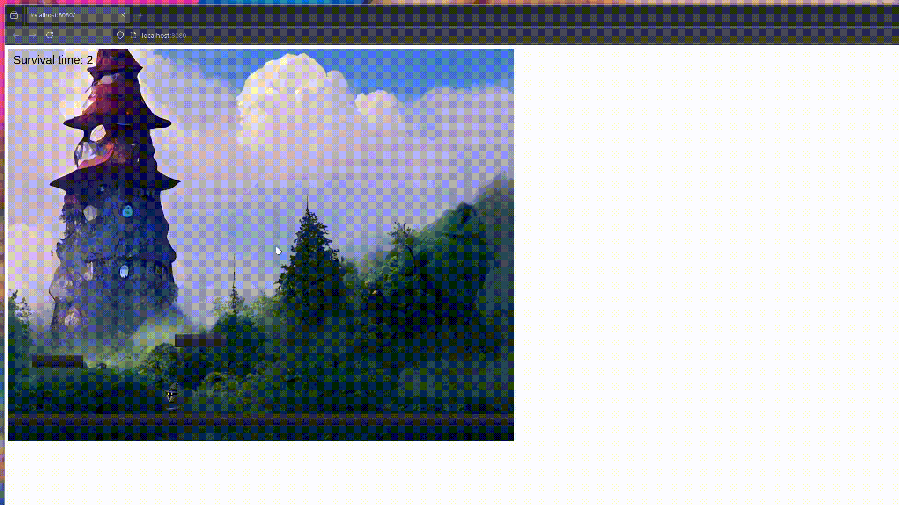

# TowerJump



TowerJump is a challenging and possibly impossible game designed as a fun project to dive into the world of Phaser. I am not sure if it is possible  
make it to the last game screen, but who knows.

## Installation

To get started with TowerJump, clone the repository and install the necessary dependencies.

```bash
git clone https://github.com/yourusername/towerjump.git
cd towerjump
npm install
```
## Running the Game  
you can start the game by running the following command:  
```bash
npm start
```
## Platform Specific Instructions  
since it runs on deprecated packages you have to export a legacy provider.  
#### Linux  
```bash
export NODE_OPTIONS=--openssl-legacy-provider  
```
#### Windows  
```bash
$env:NODE_OPTIONS="--openssl-legacy-provider"
```


